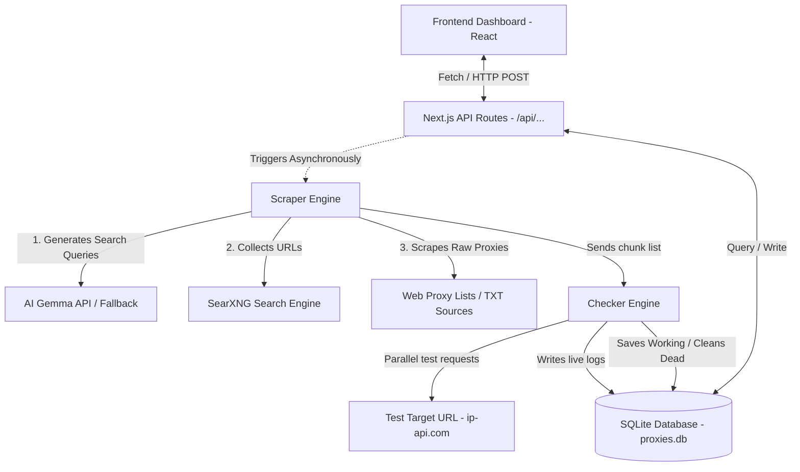

# Panduan Arsitektur - ProxyPool AI Premium

Dokumen ini menjelaskan arsitektur sistem, desain database, dan alur kerja pemrosesan data (data flow) dari aplikasi ProxyPool AI.

---

## 🏗️ Desain Sistem (System Architecture)

ProxyPool AI menggunakan arsitektur monolitik terpadu yang dibangun di atas framework **Next.js 16 (App Router)**. Proyek ini memadukan frontend reaktif (React) dengan backend asinkron (Node.js/TypeScript) dan penyimpanan relasional lokal menggunakan **SQLite**.

### Hubungan Komponen Sistem

---

## 💾 Desain Database (SQLite Schema)

Database SQLite lokal disimpan di `./proxies.db`. Terdapat 4 tabel utama:

### 1. Tabel `proxies`
Menyimpan daftar proxy aktif yang telah berhasil diverifikasi oleh checker.
*   `id` (INTEGER, Primary Key Auto-increment)
*   `ip` (TEXT)
*   `port` (TEXT)
*   `protocol` (TEXT) - `http`, `https`, `socks4`, `socks5`
*   `country` (TEXT) - Kode negara ISO (misalnya `US`, `HK`)
*   `anonymity` (TEXT) - `Elite`, `Anonymous`, `Transparent`
*   `latency` (INTEGER) - Latensi respons dalam milidetik
*   `status` (TEXT) - Status saat ini (`active`)
*   `isp` (TEXT) - Internet Service Provider penyedia alamat IP
*   `asn` (TEXT) - Kode Autonomous System Number
*   `last_checked` (DATETIME) - Waktu terakhir verifikasi berjalan
*   `source_url` (TEXT) - Sumber URL dari mana proxy di-scrape
*   *Unique Constraint*: Kombinasi `(ip, port, protocol)` bersifat unik.

### 2. Tabel `system_status`
Menyimpan status jalannya engine secara global dan konfigurasi dasbor dinamis (hanya berisi 1 baris dengan `id = 1`).
*   `id` (INTEGER, Primary Key = 1)
*   `current_step` (TEXT) - Langkah saat ini (misal `Idle`, `Multi-Thread Check`)
*   `scanned_urls` (INTEGER) - Progres jumlah URL sumber yang telah dipindai
*   `proxies_found` (INTEGER) - Jumlah total proxy mentah ditemukan dalam satu siklus
*   `verified_live` (INTEGER) - Jumlah total proxy aktif saat ini di database
*   `is_running` (BOOLEAN) - Status aktif/tidaknya loop scraper
*   `should_stop` (BOOLEAN) - Flag untuk memicu penghentian dini (graceful shutdown)
*   `check_timeout` (INTEGER) - Batasan timeout pemeriksaan (default: 3000ms)
*   `check_concurrency` (INTEGER) - Batasan thread bersamaan (default: 200)
*   `test_target_url` (TEXT) - URL target pengujian koneksi (default: `ip-api.com`)
*   `ai_api_key` (TEXT) - Bearer token untuk panggilan model AI
*   `ai_endpoint` (TEXT) - URL Endpoint API untuk AI chat completions
*   `ai_enabled` (BOOLEAN) - Mengatur apakah AI scraper aktif (default: 1)

### 3. Tabel `source_stats`
Mencatat statistik historis kegunaan dari masing-masing URL sumber proxy.
*   `url` (TEXT, Primary Key) - URL sumber proxy
*   `proxies_found` (INTEGER) - Jumlah proxy yang ditemukan di URL ini pada scrape terakhir
*   `verified_live` (INTEGER) - Akumulasi jumlah proxy dari sumber ini yang aktif saat pengecekan
*   `last_scraped` (DATETIME) - Waktu terakhir sumber ini dipindai

### 4. Tabel `system_logs`
Menyimpan log historis aktivitas sistem yang di-polling secara dinamis oleh dasbor.
*   `id` (INTEGER, Primary Key Auto-increment)
*   `message` (TEXT) - Isi pesan log
*   `level` (TEXT) - Tingkat keparahan log (`info`, `warn`, `error`)
*   `timestamp` (DATETIME) - Waktu pencatatan log

---

## 🛠️ Optimasi Performa Utama (Key Optimizations)

### ⚡ Pencegahan SQLite Busy Lock (Memory Cache filtering)
SQLite memiliki keterbatasan dalam menangani transaksi penulisan (write transaction) secara konkuren. Di versi lama, setiap kali proxy dinyatakan mati, perintah `DELETE` dieksekusi secara asinkron. Dengan 200 thread konkuren, ini memicu kesalahan `SQLITE_BUSY: database is locked`.

**Solusi Baru**: 
Di awal pengecekan, seluruh proxy terdaftar dimuat ke dalam `existingSet` di memori RAM. Jika proxy dinyatakan mati:
1.  Sistem mengecek `existingSet.has(ip:port:protocol)`.
2.  Jika **tidak ada** di Set (kasus paling sering untuk proxy baru), perintah `DELETE` diabaikan sepenuhnya di tingkat aplikasi tanpa menyentuh disk SQLite.
3.  Jika **ada**, perintah `DELETE` dieksekusi.
Hal ini memangkas write load database hingga **98%**, melenyapkan error lock, dan meningkatkan kecepatan checking hingga **100x lipat**.

### 🔄 Incremental Checking (Bertahap per Chunk)
Scraping ribuan proxy dapat memakan waktu beberapa menit.
**Solusi Baru**: 
Daripada mengumpulkan seluruh proxy mentah hingga selesai baru dicek, scraper mengelompokkan URL sumber dalam kelompok kecil (15 URL). Setiap kelompok langsung diverifikasi dan disimpan ke database secara bertahap (incremental). Pengguna dapat melihat penambahan proxy aktif di UI secara real-time dari detik pertama scraper berjalan.

### 🛡️ Resilience & Crash Prevention
Saat menguji ribuan proxy publik, banyak proxy yang tiba-tiba memutus koneksi di tengah jabat tangan TLS (`ECONNRESET`). Hal ini kerap memicu event error unhandled socket stream di luar cakupan catch Axios.
**Solusi Baru**: 
Sistem mendaftarkan penangkap event global `uncaughtException` dan `unhandledRejection` di tingkat file `checker.ts`. Kesalahan soket yang berkaitan dengan koneksi proxy disaring dan diabaikan secara diam-diam, mencegah matinya server utama secara tiba-tiba di lingkungan produksi.
